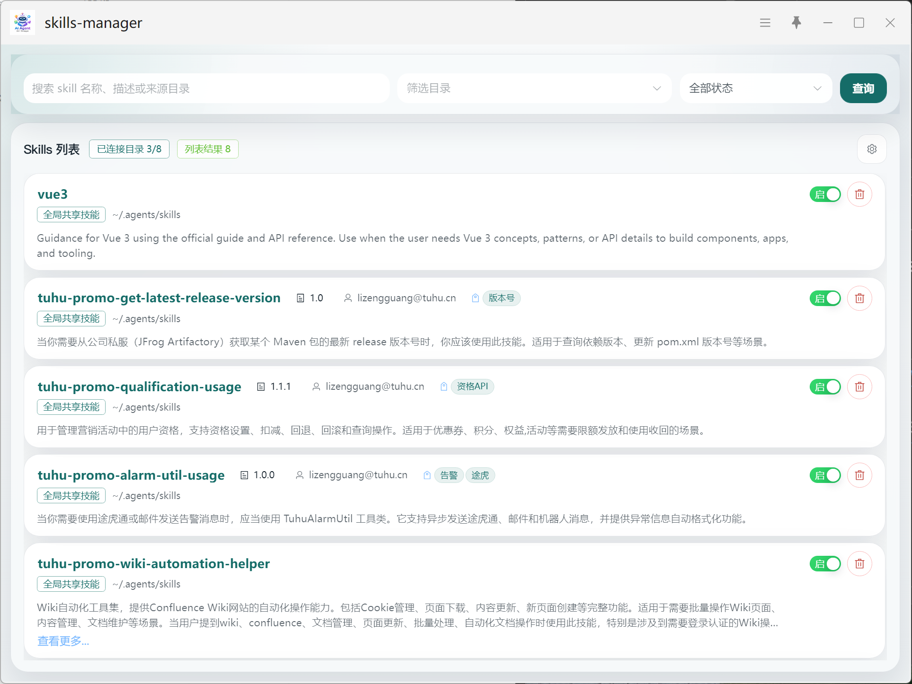
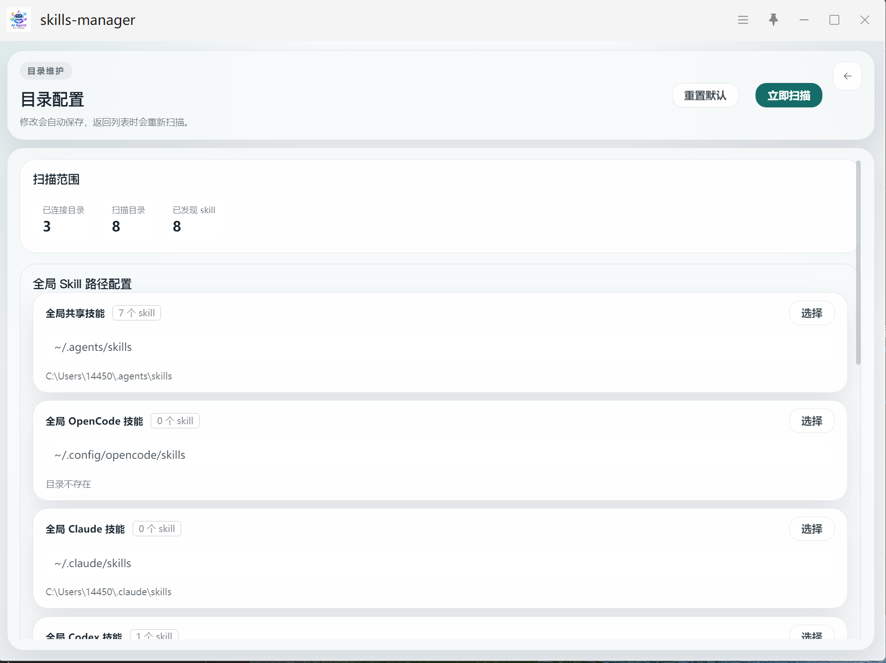

<div align="center">

[](#)

<h1>Skills Manager</h1>

</div>

[](https://github.com/yourusername/skills-manager)
[](LICENSE)
[](https://vuejs.org/)
[](https://www.u-tools.cn/)
[](https://nodejs.org/)
[](https://vitejs.dev/)

<blockquote>
一个强大且美观的 uTools 插件，用于可视化管理本地已安装的 GenX Skills，提供便捷的目录配置、技能浏览和快速启动功能。
</blockquote>

---

## ✨ 特性

- 🔍 **可视化浏览** - 直观的列表视图展示所有已安装的 Skills
- ⚡️ **快速启动** - 支持多指令快速调用，提高工作效率
- ⚙️ **灵活配置** - 自定义扫描目录路径，适应不同工作环境
- 🎨 **现代化 UI** - 基于 Vue 3 构建的现代化用户界面
- 🌓 **暗色模式** - 完美支持系统暗色模式切换
- 📦 **轻量高效** - 基于 Vite 构建，启动迅速

## 📸 截图

### 主界面


### 设置界面


## 🚀 快速开始

### 方式一：uTools 应用商店安装

在 uTools 应用商店搜索以下关键词即可找到并安装：

```
Skills Manager | 技能管理 | skills | skill manager
```

### 方式二：本地安装

1. **克隆仓库**

```bash
git clone https://github.com/yourusername/skills-manager.git
cd skills-manager
```

2. **安装依赖**

```bash
npm install
```

3. **开发模式**

```bash
npm run dev
```

> 💡 开发服务器将在 http://localhost:5173 启动

4. **构建生产版本**

```bash
npm run build
```

构建产物将输出到 `dist/` 目录，将其打包为 uTools 插件即可使用。

## 📖 使用指南

### 快捷指令

在 uTools 中输入以下任一指令即可启动插件：

| 指令 | 描述 |
|------|------|
| `skills` | 快速启动 Skills Manager |
| `skills manager` | 启动技能管理器 |
| `管理 skills` | 中英文混合指令 |
| `技能管理` | 中文指令 |

### 核心功能

1. **查看 Skills 列表** - 自动扫描并列出所有已安装的 Skills
2. **配置扫描目录** - 在设置页面自定义 Skills 存储路径
3. **详细信息展示** - 查看 Skill 的描述、版本等元信息

## 🛠 技术栈

| 技术 | 版本 | 说明 |
|------|------|------|
|  | 3.5.13 | 渐进式 JavaScript 框架 |
|  | 5.0+ | JavaScript 的超集 |
|  | 6.0.11 | 下一代前端构建工具 |
|  | Latest | uTools 插件 API |
|  | 16+ | JavaScript 运行环境 |

## 📁 项目结构

```
skills-manager/
├── public/
│   ├── plugin.json           # 插件配置文件
│   ├── logo.png             # 插件图标
│   └── preload/
│       ├── package.json     # Preload 依赖配置
│       └── services.js      # Node.js 预加载脚本
├── src/
│   ├── main.js              # 应用入口文件
│   ├── App.vue              # 根组件
│   ├── main.css             # 全局样式文件
│   └── */                   # 功能组件目录
├── dist/                    # 构建输出目录
├── imgs/                    # 项目截图资源
├── package.json             # 项目依赖配置
├── README.md                # 项目说明文档
└── AGENTS.md                # 开发规范文档
```

## 🧩 开发规范

本项目严格遵循以下开发规范：

- **前端代码**
  - 使用 Vue 3 Composition API (`<script setup>`)
  - 采用 TypeScript 提供类型安全
  - 组件命名使用 `PascalCase`
  - 变量/函数使用 `camelCase`
  - 常量使用 `UPPER_SNAKE_CASE`

- **Preload 代码**
  - 使用 CommonJS 规范（`require`）
  - 保持代码清晰可读，不可混淆编译
  - 通过 `window.services.*` 暴露服务

- **API 调用**
  - uTools API: `window.utools.*`
  - 本地服务: `window.services.*`
  - 不在 Vue 组件中直接使用 Node.js 模块

> 📚 详细规范请参考 [AGENTS.md](./AGENTS.md) 文档

## 🔧 配置说明

### plugin.json 关键配置

```json
{
  "main": "index.html",
  "preload": "preload/services.js",
  "pluginSetting": {
    "single": true,
    "height": 544
  }
}
```

- `main` - 插件入口 HTML 文件
- `preload` - 预加载脚本路径
- `pluginSetting.single` - 单例运行模式
- `pluginSetting.height` - 默认窗口高度

## 🤝 贡献指南

我们欢迎所有形式的贡献！如果您想改进这个项目，请：

1. Fork 本仓库
2. 创建特性分支 (`git checkout -b feature/AmazingFeature`)
3. 提交更改 (`git commit -m 'Add some AmazingFeature'`)
4. 推送到分支 (`git push origin feature/AmazingFeature`)
5. 提交 Pull Request

## 📝 更新日志

### [1.0.0] - 2026-03-26

#### 新增
- ✨ 插件初始发布
- ✨ Skills 列表可视化
- ✨ 扫描目录配置功能
- ✨ 多指令快捷启动
- ✨ 暗色模式支持

## 📄 许可证

本项目采用 [MIT License](LICENSE) 开源协议。

## 🔗 相关资源

- [uTools 官方文档](https://www.u-tools.cn/docs/)
- [uTools 插件快速开始](https://www.u-tools.cn/docs/developer/basic/getting-started.html)
- [plugin.json 配置说明](https://www.u-tools.cn/docs/developer/information/plugin-json.html)
- [uTools API 文档](https://www.u-tools.cn/docs/developer/docs.html)
- [Vue 3 官方文档](https://vuejs.org/)
- [Vite 官方文档](https://vitejs.dev/)

## ⭐ Star History

如果这个项目对您有帮助，请给我们一个 Star ⭐

---

<div align="center">

Made with ❤️ by the Skills Manager Team

</div>
